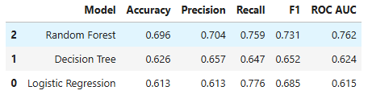
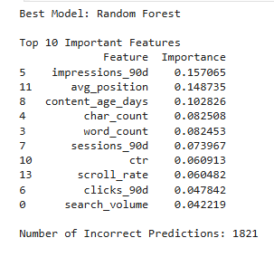
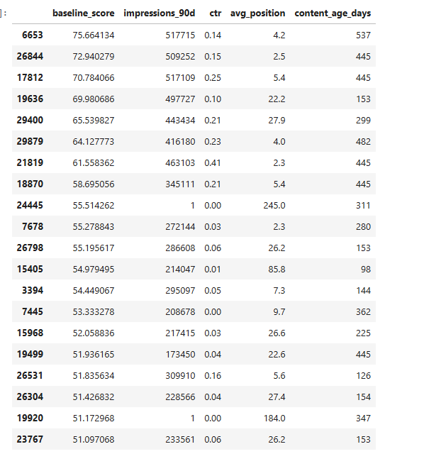

# Refresh / Content Opportunity Scoring Using Machine Learning

## Table of Contents

- Abstract
- Introduction
- Problem Statement
- Dataset
- Methodology
- Results
- Limitations and Honest Framing
- Ranked Recommendations
- Reproducibility
- Acknowledgments and Data Credit
  
## Abstract

Keeping website content up to date is important for maintaining search visibility and user engagement. In this project, I built a machine learning model to identify webpages that are good candidates for content refresh. The model was trained using the anonymized FlyRank ML Internship dataset containing search performance and content features. I compared a rule-based baseline with several machine learning models and selected the Random Forest model because it achieved the best overall performance. The final output is a ranked list of webpages with recommended actions and reason codes to support editorial decisions. The results are intended to assist human reviewers and should not be treated as automatic publishing decisions.

---

# Introduction

Large websites often contain thousands of webpages, making it difficult for editors to manually identify which pages need updates. Some pages gradually lose traffic because their content becomes outdated, while others continue to perform well. Reviewing every page individually is time-consuming and inefficient.

Machine learning can help by analyzing historical search and content performance data to identify pages that are more likely to benefit from a content refresh. Instead of replacing human judgment, the model provides a ranked list of recommendations so that editors can focus their efforts on the pages with the highest potential impact.

This project focuses on the **Refresh / Content Opportunity Scoring** lane. The goal is to predict which webpages should be reviewed first for a content refresh based on observable search performance, engagement metrics, and content characteristics.

---

# Problem Statement

The objective of this project is to rank webpages according to their likelihood of needing a content refresh. The model uses historical search performance and content-related features to generate recommendations that help editors prioritize their work.

The output of this project is intended for decision support. All recommendations should be reviewed by a human before any changes are made.

# Dataset

This project uses the anonymized FlyRank ML Internship dataset. The dataset contains **30,000 webpages**, where each row represents a single webpage and its recent search and engagement performance.

The dataset includes features related to search visibility, user engagement, and content characteristics. Examples include impressions, clicks, click-through rate (CTR), average search position, content age, word count, engagement rate, and scroll rate. Client names, URLs, keywords, and other sensitive information were removed to protect privacy.

The target label identifies whether a webpage is showing declining performance based on its recent trend direction. In the dataset, **16,262 pages (54.2%)** are labeled as declining and **13,738 pages (45.8%)** are labeled as not declining.

Only features that would be available before making a recommendation were used for training. Label-derived fields and future information were excluded to avoid data leakage.

---

# Methodology

The project follows a complete machine learning workflow. First, the data was cleaned by handling missing values and converting categorical variables into numerical form where required. A baseline scoring rule was created to provide an initial ranking of webpages.

Several machine learning models were then trained and compared, including Logistic Regression, Decision Tree, and Random Forest. The models were evaluated using a client-holdout validation strategy to reduce information leakage between training and testing data.

The Random Forest model achieved the best overall performance and was selected as the final model. The model predicts the probability that a webpage needs a content refresh and generates a ranked list of recommendations with reason codes. These recommendations are intended to support editorial decisions and are not automatic publishing decisions.

The dataset was divided using a client-holdout validation strategy so that webpages from the same client were not present in both training and testing sets. This reduces information leakage and provides a more realistic estimate of model performance.

# Results

Three machine learning models were trained and evaluated for predicting webpages that may require a content refresh. Logistic Regression, Decision Tree, and Random Forest were compared using Accuracy, Precision, Recall, F1-score, and ROC-AUC.

The Random Forest model achieved the best overall performance and was selected as the final model for this project.

**Figure 1.** Performance comparison of Logistic Regression, Decision Tree, and Random Forest models.

| Model | Accuracy | Precision | Recall | F1 Score | ROC-AUC |
|--------|---------:|----------:|--------:|---------:|---------:|
| Logistic Regression | 0.613 | 0.613 | 0.776 | 0.685 | 0.615 |
| Decision Tree | 0.626 | 0.657 | 0.647 | 0.652 | 0.624 |
| **Random Forest** | **0.696** | **0.704** | **0.759** | **0.731** | **0.762** |

Random Forest was selected because it achieved the highest Accuracy, Precision, F1-score, and ROC-AUC among all evaluated models while maintaining strong Recall.

The Random Forest model also provided feature importance scores, showing which features contributed most to the prediction. Impressions over the last 90 days, average search position, content age, and content size were the strongest indicators.

**Figure 2.** Top features used by the Random Forest model.

The feature importance analysis indicates that impressions over the last 90 days and average search position contributed most to the model's predictions. Content age, word count, and sessions also had meaningful influence, while lower-ranked features contributed less.

After selecting the best model, webpages were ranked based on their predicted priority for content refresh. Pages with higher scores were placed at the top of the recommendation queue so editors can review them first.

**Figure 3.** Sample of the ranked recommendation queue generated by the model.

---

## Error Analysis

The Random Forest model produced the best overall performance, but some webpages were still classified incorrectly. These errors may occur because search performance depends on factors that are not included in the dataset, such as seasonal demand, competitor activity, search engine algorithm updates, and editorial changes.

The model should therefore be viewed as a decision-support tool rather than an automated decision system.
# Limitations and Honest Framing

This project identifies webpages that may benefit from a content refresh using historical search and engagement data. The results are intended to support editorial decisions and should not be interpreted as proof that refreshing a page will improve search rankings. External factors such as seasonality, competitor activity, and search engine updates are not included in the dataset and may affect page performance. Human review should always be performed before taking action.

---

# Ranked Recommendations

Based on the model predictions, the following actions are recommended:

- Refresh pages with high impressions but low click-through rates.
- Review pages with poor average search positions.
- Update older content that has not been refreshed recently.
- Improve pages with low engagement metrics.
- Continue monitoring pages with stable performance.

---

# Reproducibility

The project was developed using Python, Pandas, Scikit-learn, and Google Colab. All notebooks, source code, and outputs are available in this repository under the `work/notebooks/` directory.

---

# Conclusion

This project demonstrated that machine learning can be used to rank webpages for potential content refresh opportunities using historical search performance data. Among the evaluated models, Random Forest produced the strongest overall performance and generated a ranked recommendation queue for editorial review.

The proposed workflow is intended to support content teams by helping prioritize webpages that may benefit from updates. Because search performance is affected by many external factors, the recommendations should always be reviewed by humans before any publishing decisions are made.

# Acknowledgments and Data Credit

This project was built using the FlyRank ML Internship dataset.

Data source: https://flyrank.ai

The dataset was provided for educational purposes as part of the FlyRank Machine Learning Internship.
